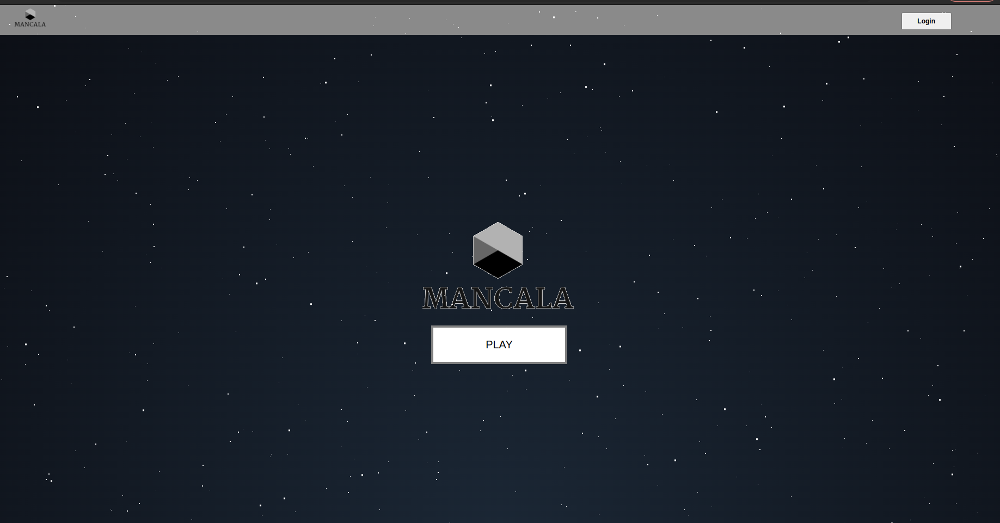
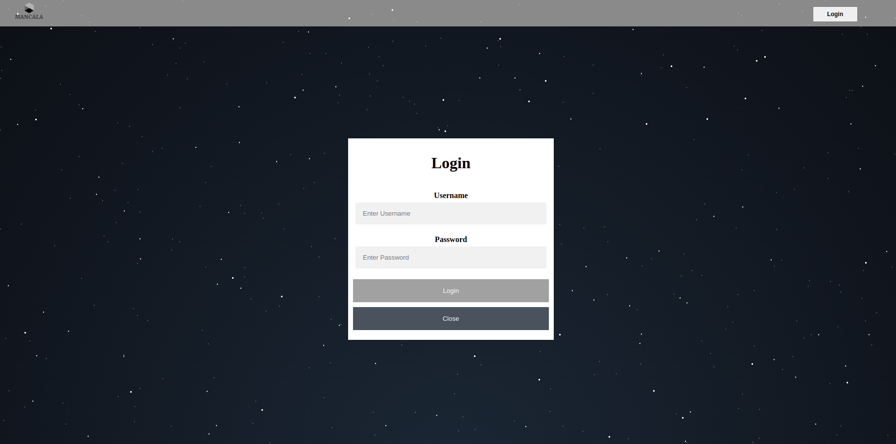
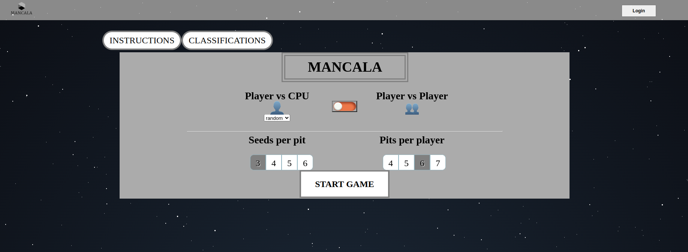
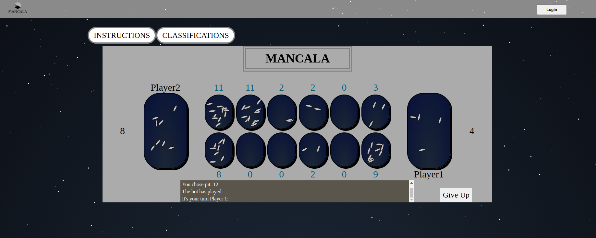

# FEUP-LTW
**Description** - Full-Stack website for the game Mancala, with the frontend done with pure html/css/js and backend server done in NODE.js

**Course** - Web Languages and Technologies

## Project Overview

[Mancala](https://endlessgames.com/wp-content/uploads/Mancala_Instructions.pdf) is a two-player strategy game played with pits and seeds. The objective is to capture more seeds than your opponent by strategically moving them among the pits on the board. The game ends when all the pits on one side of the board are empty, and the player with the most seeds in their capture pit wins.
<br/>
On this website, users can play "Player vs Player" or "Player vs CPU" with 4 different CPU difficulties: random, easy, medium, and hard. The CPU moves are determined by a minimax algorithm, with the depth of the algorithm increasing with the difficulty level (easy-1, medium-3, hard-5).
<br/>
Furthermore, the game allows users to customize the initial board by defining the number of pits and the number of starting seeds in each pit.
Additionally, the game supports "Player vs Player" play on a local network via a Node.js server.

## Usage

Simply execute the ```index.html``` file. For the Node.js server, run ```index.js``` file.

## Game Screenshots

#### Main Menu


#### Login


#### Game Menu


#### Gameplay
